## MERN-TERRAFORM-ANSIBLE-HV
- this repo consists the deployment code of the mern using the terraform and ansible.

## Part 1: Infrastructure Setup with Terraform: -
# 1. AWS Setup and Terraform Initialization:-
- Install AWS CLI: Follow AWS CLI installation guide.
- Once installed, configure it with:
aws configure
- Enter your AWS access key, secret key, region, and output format when prompted.
# Install Terraform: Download and install Terraform from here.
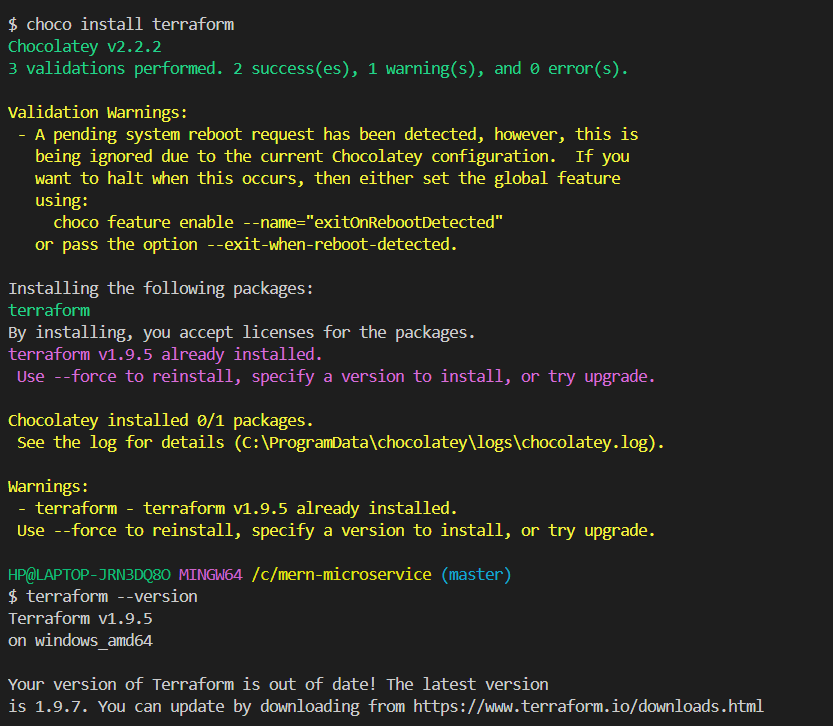

- Initialize Terraform Project: Create a new directory for your Terraform project:

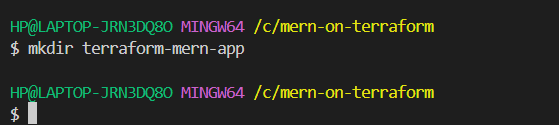

- Create a file main.tf and start by configuring the provider:

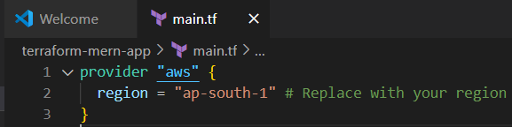

# 2. VPC and Network Configuration:

- Create a VPC with subnets: Define the VPC and subnets (public and private) in main.tf:

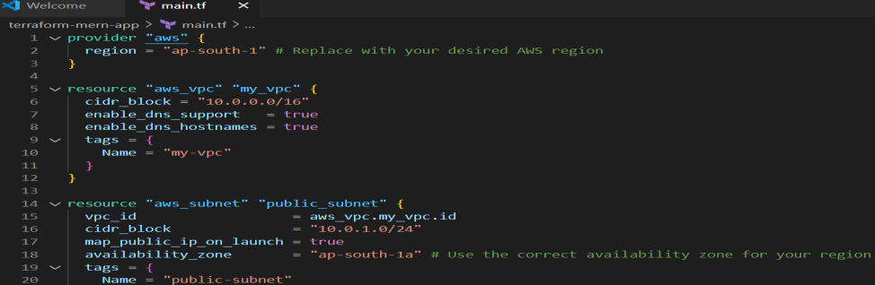

- Set up Internet and NAT Gateways: Add this to main.tf:

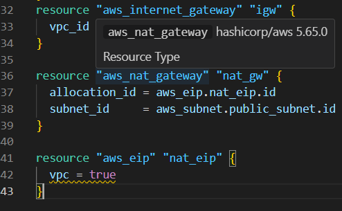

- Route Tables Configuration:

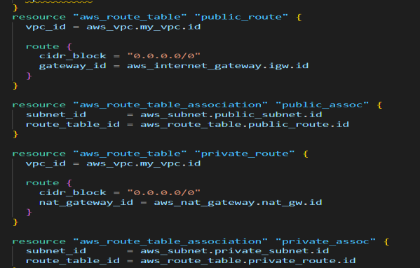

# 3. EC2 Instance Provisioning:

- Provision EC2 Instances: Create one instance in the public subnet for the web server and one in the private subnet for MongoDB:

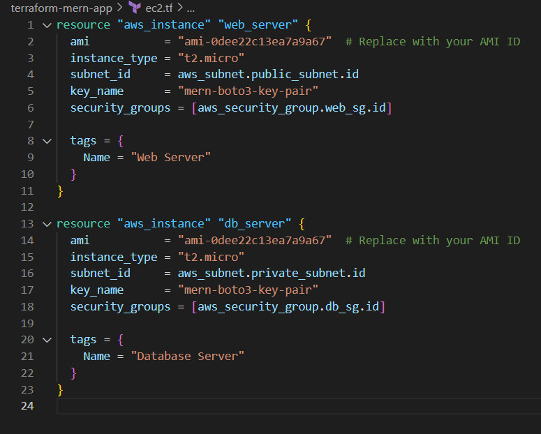

- IAM Role: Create an IAM role for EC2 instances with necessary permissions:

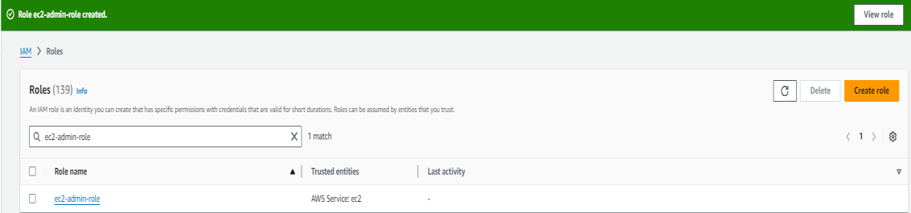

- Infra creation on aws using terraform below is the main.tf file which is used to provision the total infra which is required to deploy our mern web-app on the aws console:

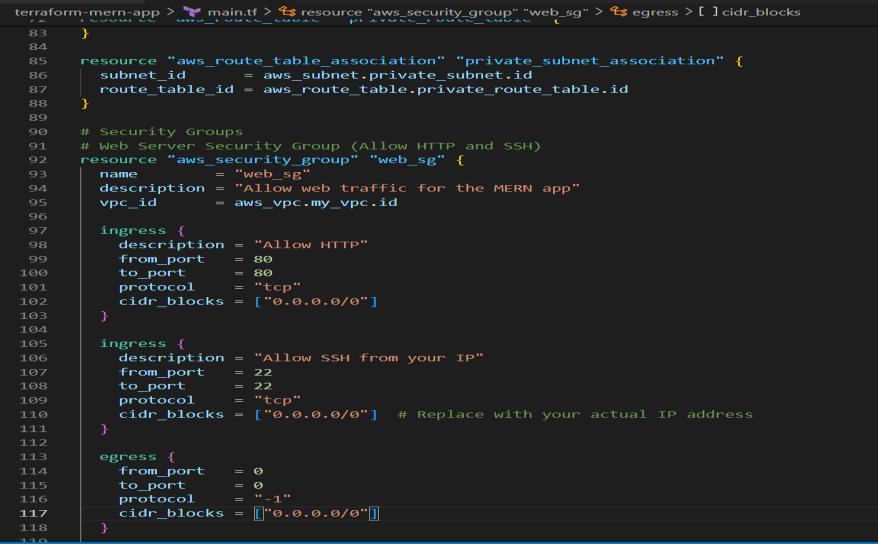

# Followed the below steps for deploying the mern-app on aws using the above script:

- a.terraform init (for the initializing the terraform in the aws environment)
- b.terraform plan (which will display what exactly will be dpeloyed after hitting the terraform apply.
- c.terraform apply (which will actually provision the infra for which you wrote the main.tf amd the one infra which was showned to you after hitting the terraform plan.

# Part 2: Configuration and Deployment with Ansible:

- 1. Ansible Configuration:
- Configure Ansible Inventory: Create an inventory file (inventory) with EC2 instance IPs:

# 2. Create the Ansible Inventory File:

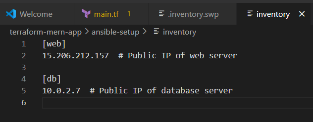

- The inventory file contains the list of your EC2 instances that Ansible will manage. It should be created on your local machine.

- Create a new directory for your Ansible files: mkdir ansible-setup (creates the directory inside our project directory), cd ansible-setup(change the directory)

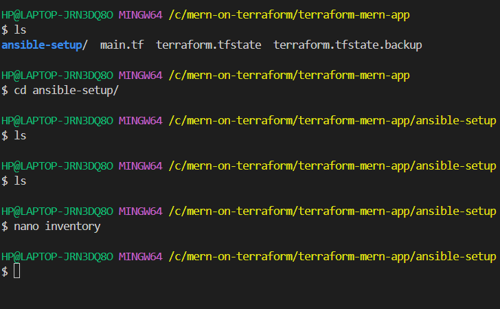

- Create an inventory file inside this directory:

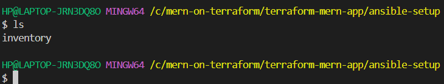

- Add the public IP addresses of your EC2 instances in the inventory file, organized by groups. Here's an example:

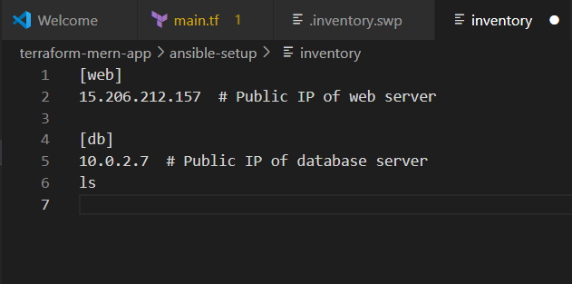

# 3. Set Up SSH Access to EC2 Instances:

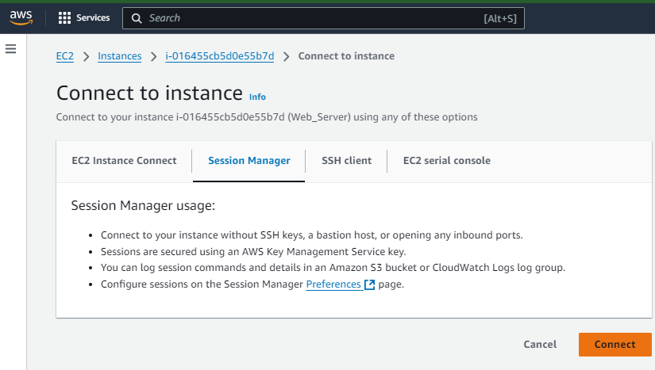

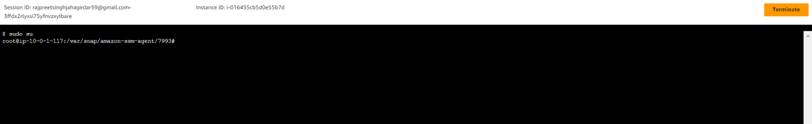

# 4. Write Your Ansible Playbooks:

- You can now create playbooks for configuring your servers.
- Create a playbook for the web server to install Node.js and clone the MERN application:
- By hittting “nano web_setup.yml”

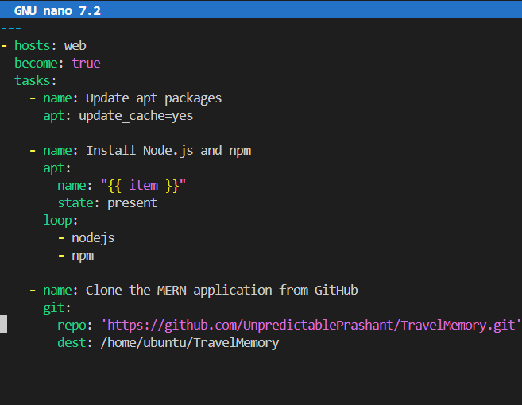

- Create a playbook for the database server to install MongoDB:

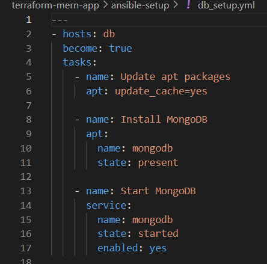

# 3.Run the playbook for the web server:

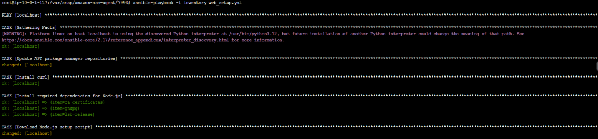

# Security Hardening:

- Harden the security by configuring firewalls and security groups.
- Implement additional security measures as needed (e.g., SSH key pairs, disabling root login).
